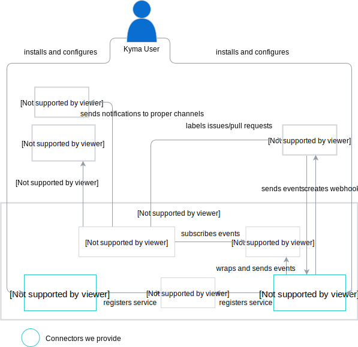

# The GitHub and Slack Connectors for Kyma

---

[](https://goreportcard.com/report/github.com/kyma-incubator/hack-showcase)

---

## Overview

Connectors for Github and Slack applications to use in [Kyma](https://github.com/kyma-project/kyma) environment. They allow utilizing applications' functions inside Kyma ecosystem by communicating with corresponding API. Use it to trigger Lambdas on events incoming from third-party applications and react to them.

## Prerequisites

* **Kyma**
Connectors are configured to work inside Kyma ecosystem, so you need to install it locally or on a cluster. See the [Installation guides](https://kyma-project.io/docs/root/kyma#installation-installation) for details.

## Usage

Showcase covers user story described in the [`project concept`](https://github.com/kyma-incubator/hack-showcase/blob/master/docs/concept.md#reacting-to-prissue-comments) - it labels issues on GitHub that may be offensive and sends notification to Slack about it. However, considering the fact that connectors provide a way to communicate with external applications, there are lots of possible use cases. Using the connector is as simple as deploying a new Lambda in Kyma - check corresponding [serverless documentation](https://kyma-project.io/docs/components/serverless) to find out more.

Diagram below shows how components interact with each other in our scenario.



## Quick start

You can install the Connectors and start using them with just few steps. Follow the instructions to install the Connectors and the scenario described above.

1. Add addons configuration to Kyma. Run:

    ``` shell
    cat <<EOF | kubectl apply -f -
    apiVersion: addons.kyma-project.io/v1alpha1
    kind: ClusterAddonsConfiguration
    metadata:
    name: addons-slack-github-connectors
    finalizers:
    - addons.kyma-project.io
    spec:
    repositories:
        - url: github.com/kyma-incubator/hack-showcase//addons/index.yaml
        - url: github.com/kyma-incubator/hack-showcase//addons/index-scenario.yaml
    EOF
    ```

2. Connect to Kyma Console (UI). Go to a Namespace of your choice, then to Catalog in Service Management section. Add the Slack Connector, the GitHub Connector and the Azure Service Broker. Follow the instructions available in these addons.
3. After provisioning, add the Azure Comments Analytics Scenario.

    >**NOTE:** Keep in mind that all resources created in previous step have to be ready. Check their status in Instances in Service Management section.

4. Create a new issue on a GitHub repository you specified during the GitHub Connector installation to check if everything is configured correctly. You should get a notification on Slack and the issue should be tagged with `Caution/offensive` label if the issue's sentiment is negative.

## Installation

Install Connectors locally or on a cluster. For installation details, see corresponding guide:

* [Github Connector installation](/docs/github-connector/installation.md)
* [Slack Connector installation](/docs/slack-connector/installation.md)

## Development

1. Fork the repository in Github.
2. Clone the fork to your `$GOPATH` workspace. Use this command to create the folder structure and clone the repository under the correct location:

    ``` shell
    git clone git@github.com:{GitHubUsername}/hack-showcase.git $GOPATH/src/github.com/kyma-incubator/hack-showcase
    ```

    Follow the steps described in the [`git-workflow.md`](https://github.com/kyma-project/community/blob/master/contributing/03-git-workflow.md) document to configure your fork.

3. Install dependencies.

    Go to the main directory of the project in your workspace location and install the required dependencies:

    ``` shell
    cd github-connector
    dep ensure -vendor-only
    ```
