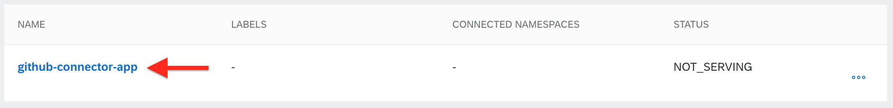
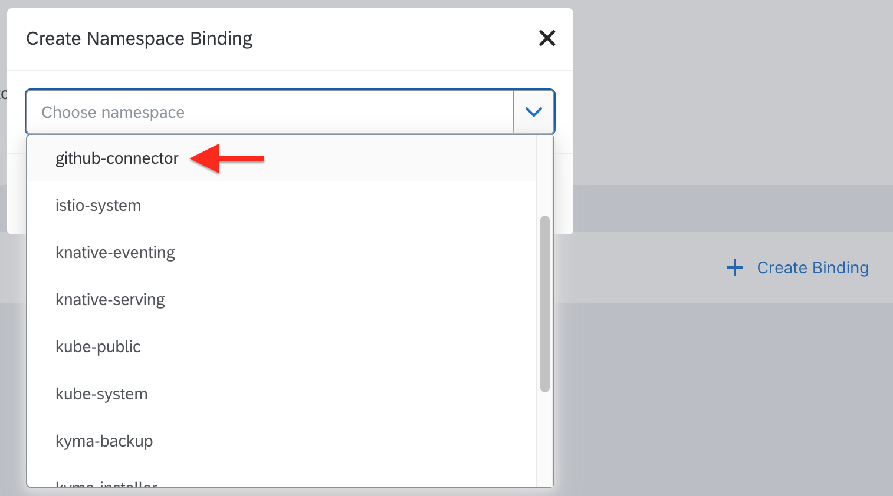

# Usage of GitHub Connector <!-- omit in toc -->

- [Prerequisites](#prerequisites)
- [Configuration of ServiceInstance to use Lambda functions](#configuration-of-serviceinstance-to-use-lambda-functions)
	- [Option 1. Through Kyma user interface](#option-1-through-kyma-user-interface)
		- [Binding application to the namespace](#binding-application-to-the-namespace)
		- [Setting up ServiceInstance and Lambda](#setting-up-serviceinstance-and-lambda)
		- [Creation of Lambda function](#creation-of-lambda-function)
	- [Option 2. Shell script](#option-2-shell-script)

## Prerequisites

- Kyma with GitHub Connector deployed on your cluster (see [installation guide](helm-installation-tutorial.md)).
- WebHook configured to deliver payload to the Connector's ```/webhook``` endpoint.

## Configuration of ServiceInstance to use Lambda functions

To write lambda in Kyma that can utilise the functionalities of GitHub Connector you must configure the application binding and ServiceInstance.

### Option 1. Through Kyma user interface

#### Binding application to the namespace

1. Choose namespace created during installation of GitHub Connector.
	

2. Click **```Show All Applications```**.
	

3. Click the application name to access its properties.
	

4. Create namespace binding. During this process **ServiceClass** and **ApplicationMapping** custom resources are created.
	
	
	
5. Now you should see this - application is bound to created namespace.
	

#### Setting up ServiceInstance and Lambda

1. Go to the namespace catalog.
2. Enter Service Catalog.
	

3. Here, under the **Services** tab you can find defined service classes. Enter **github-connector** ServiceClass. In this place you are able to find defined events and registered GitHub API.
	

4. Click **```Add once```** button to provide ServiceInstance for **github-connector** ServiceClass. Create it with Default Plan and provided name.
	

5. In the Instance Catalog under **Services** tab you can find the newly created instance and its status.
	

6. In the **Lambdas** catalog in namespace click **```+ Add Lambda```** to start creating lambda function.
	

#### Creation of Lambda function

After clicking **```+ Add Lambda```** you will be able to select triggering options and write body of your function.

1. Choose function name and click **```+ Select Funtion Trigger```** to choose the trigger method.
	
2. From the drop-down menu that appears choose the trigger option you desire. For the purpose of this example **Event Trigger** is chosen.
	
3. Select events for which this specific lambda you desire to be able to react.
	
4. Create service binding and choose your service. Click **```Create Service Binding```** to apply binding.
   	

5. Write body of your function and click **```Create```**.
	

Everything should be working now.

### Option 2. Shell script

1. Go to the `/chart/demoscenario` directory, where you can find `demoscenario.sh` script.

2. Run the script and supply the name, which has to be the same as the one you used as release name while installing GitHub Connector with helm, and the namespace in which GitHub Connector application is running (github-connector).

   ```shell
   sh demoscenario.sh gh-connector-example github-connector
   ```

   You can see output similar to the following:

   ```
   applicationmapping.applicationconnector.kyma-project.io/gh-connector-example-app created
   serviceinstance.servicecatalog.k8s.io/gh-connector-example created
   function.kubeless.io/gh-connector-example-lambda created
   subscription.eventing.kyma-project.io/gh-connector-example-lambda-issuesevent-opened-v1 created
   Subscribed! Happy GitHub Connecting!
   ```

   Lambda reacts to new issues opened in GitHub repository you are bound to. It logs `Issue opened` when someone creates a new issue.
