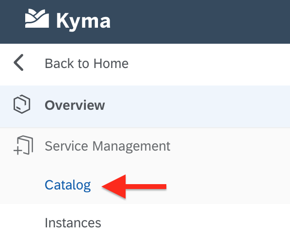
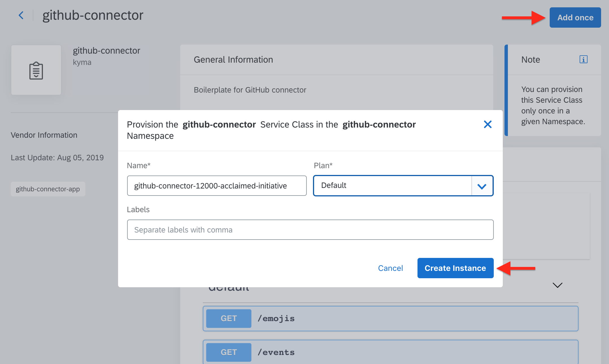

# Usage of GitHub Connector <!-- omit in toc -->

- [Prerequisites](#prerequisites)
- [Configuration of ServiceInstance to use Lambda functions](#configuration-of-serviceinstance-to-use-lambda-functions)
	- [Option 1. Through Kyma user interface](#option-1-through-kyma-user-interface)
		- [Binding application to the namespace](#binding-application-to-the-namespace)
		- [Setting up ServiceInstance and Lambda](#setting-up-serviceinstance-and-lambda)
	- [Option 2. Helm chart](#option-2-helm-chart)
	- [Option 3. Shell script](#option-3-shell-script)

## Prerequisites

* Kyma with GitHub Connector deployed on your cluster (see [installation guide](helm-installation-tutorial.md)).
* WebHook configured to deliver payload to the Connector's ```/webhook``` endpoint.

## Configuration of ServiceInstance to use Lambda functions

To write lambda in Kyma that can utilise the functionalities of GitHub Connector you must configure the application binding and ServiceInstance.

### Option 1. Through Kyma user interface

#### Binding application to the namespace

1. Choose namespace created during installation of GitHub Connector.
	

2. Click **```Show All Applications```**.
	

3. Click the application name to access its properties.
	

4. Create namespace binding. During this process **ServiceClass** and **ApplicationMapping** custom resources are created.
	
	
	
5. Now you should see this - application is bound to created namespace.
	

#### Setting up ServiceInstance and Lambda

1. Go to the namespace catalog.
2. Enter Service Catalog.
	

3. Here, under the **Services** tab you can find defined service classes. Enter **github-connector** ServiceClass. In this place you are able to find defined events and registered GitHub API.
	

4. Click **```Add once```** button to provide ServiceInstance for **github-connector** ServiceClass. Create it with Default Plan and provided name.
	

5. In the Instance Catalog under **Services** tab you can find the newly created instance and its status.
	

6. In the **Lambdas** catalog in namespace click **```+ Add Lambda```** to start creating lambda.
	

### Option 2. Helm chart

### Option 3. Shell script